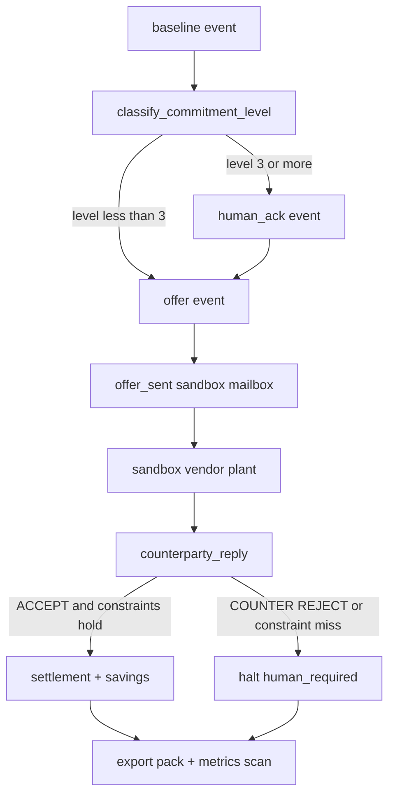
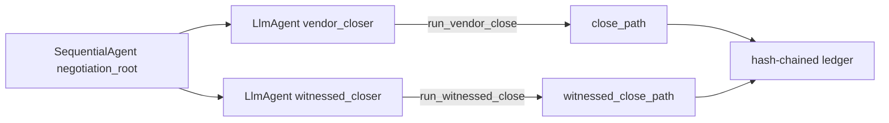

# Architecture — vendor-renewal close path

Nothing acts until it is an event on a hash-chained ledger. The plant cannot invent a concession. Settlement cannot record savings that violate the baseline cap.

ADK wrap (optional Runner; tools are the source of money figures):

